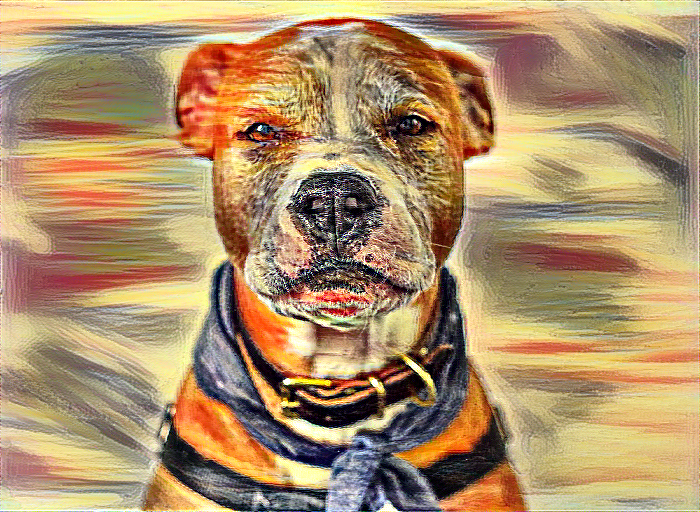

## Style Transfer 

Style Transfer is a process in which we strive to modify the style of an image while preserving its content. Given an input image and a style image, we can compute an output image with the original content but a new style.

## Some of the output images generated while training them the results are:

# Note

I only made upto 10 iterations to make the result more quicker and it's upto you, can train to many interations that you want to be to make image more clear it depends on the image clarity and the style you choose. 

## Input

  
  
## Style

  
  
## Output

### 1 iteration

  

### 2 iterations

  

### 5 iterations

  
  
 ### 10 iterations 
  
  
  
  ## Output
  
  
  
  
## How does it work?
1. I've taken input image and style images and resize them to equal shapes.
2. Then i loaded a pre-trained CNN (VGG16).
3. Knowing that we can distinguish layers that are responsible for the style (basic shapes, colors etc.) and the ones responsible for the content (image-specific features), we can separate the layers to independently work on the content and style.
4. Then I set our task as an optimization problem where we are going to minimize:
	* **content loss** (distance between the input and output images - we strive to preserve the content)
	* **style loss** (distance between the style and output images - we strive to apply a new style)
	* **total variation loss** (regularization - spatial smoothness to denoise the output image)
5. Finally, I set our gradients and optimize with the [L-BFGS](https://en.wikipedia.org/wiki/Limited-memory_BFGS) algorithm.
 
## Credits
This code is inspired from the [pytorch tutorial](https://pytorch.org/tutorials/advanced/neural_style_tutorial.html),
Thanks to the original style transfer paper from [Gatys and al.](https://zpascal.net/cvpr2016/Gatys_Image_Style_Transfer_CVPR_2016_paper.pdf)
